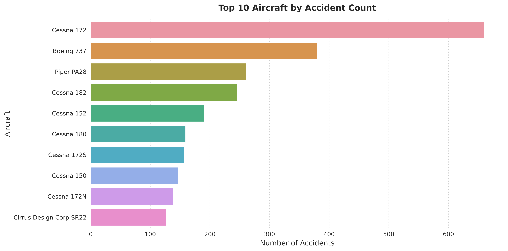
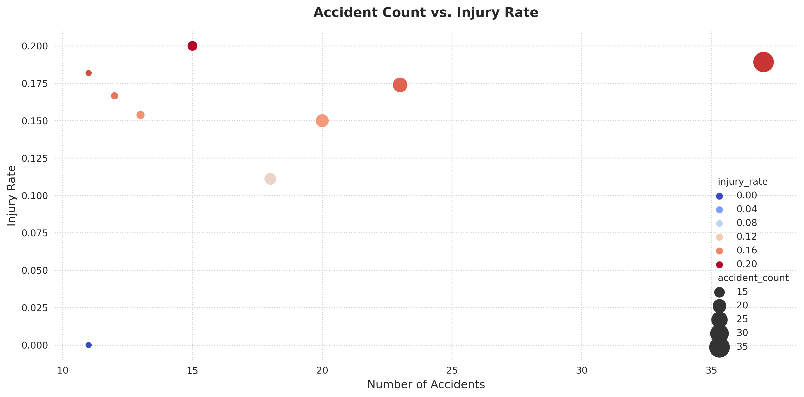
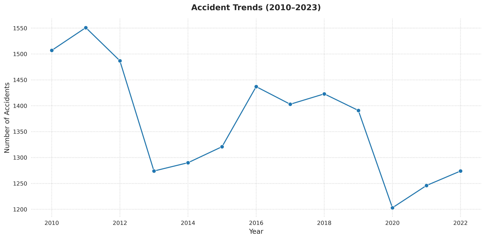

# ✈️ Aviation Safety Analysis (2010–2023)

## Overview

This project analyzes aviation accident data from the NTSB to identify low-risk aircraft types for a company expanding into commercial and private aviation.

## Business Understanding

The company aims to purchase aircraft but lacks domain-specific safety insights. This analysis helps decision-makers understand which aircraft present the lowest operational risk.

## Data Understanding and Analysis

**Data Source:**  
[NTSB Aviation Accident Dataset](https://www.ntsb.gov/)  
Filtered from 1962–2023 to only 2010–2023 civil airplane accidents in the U.S.

**Key Columns Used:**
- `event_date`, `make`, `model`, `injury_severity`
- `total_fatal_injuries`, `total_uninjured`, `aircraft_category`
- Derived: `aircraft` = Make + Model

**Data Cleaning & Imputation:**
- Filtered for airplanes (not helicopters, balloons, etc.)
- Standardized column names
- Imputed numerical columns with medians
- Categorical columns filled with "Unknown"

**Analysis Metrics:**
- Total accident count
- Total injuries & fatality rate
- Average number of uninjured passengers

## Visualizations

### 1. Top 10 Aircraft by Accident Count

### 2. Injury Rate vs. Accident Count (Scatter Plot)

### 3. Accidents Over Time (Line Chart)

## Conclusion
Three key recommendations:
1. **Prioritize aircraft with lowest injury rates** (e.g. *Beech 58*, *Cessna 172*)
2. **Avoid aircraft with high fatal/frequent accident records** (e.g. *Piper PA-28*)
3. **Use historical injury patterns to inform safety training and maintenance**

## 🔗 Dashboard
Explore the [interactive Tableau dashboard](https://public.tableau.com/app/profile/barclay.koin/viz/monalisa_17513566869560/Dashboard1) for detailed breakdowns by aircraft type, injuries, and trends.
    